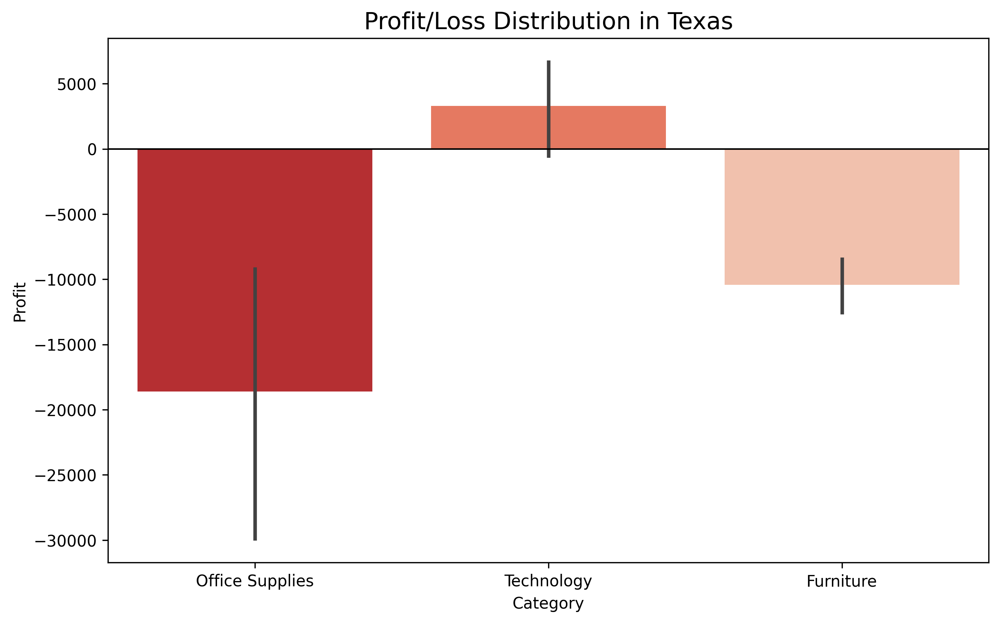

# 📊 Superstore Sales & Profit Analysis

## 📌 Project Overview
This project explores a Superstore dataset to identify the root causes of losses in specific states and categories. The goal is to provide data-driven recommendations to improve profitability.

## 🔍 Key Interpretation 
After performing data cleaning and EDA (Exploratory Data Analysis), we found:

1. **The Discount Impact:** - There is a **negative correlation (-0.22)** between Discount and Profit.
   - High discounts are not leading to more profit; instead, they are causing significant losses.

2. **The Texas Crisis:**
   - **Texas** is the most problematic state, showing a total loss of over **$25,000**.
   - Specifically, **Office Supplies** in Texas is the biggest "Profit Eater" with a loss of **-$18,606**.

3. **Product Performance:**
   - **Technology** is generally profitable across all states.
   - **Furniture (Tables and Bookcases)** consistently shows negative margins in high-discount zones.

## 📉 Visualizing the Loss

## 💡 Recommendations
- Reduce discounts in Texas, Ohio, and Illinois.
- Focus on selling high-margin products like Copiers and Accessories.
- Review shipping costs for Furniture items in the Southern region.

## 🛠️ Tools Used
- **Language:** Python
- **Libraries:** Pandas, Matplotlib, Seaborn
- **Environment:** VS Code (Jupyter Notebook)
